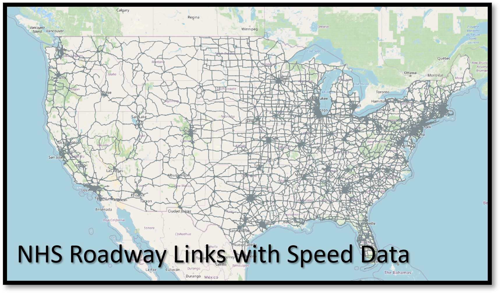

# README Outline:
* Project Description
* Prerequisites
* Usage
	* Building
	* Testing
	* Execution
* Additional Notes
* Version History and Retention
* License
* Contributions
* Contact Information
* Acknowledgements

# Project Description

### ROADII Use Case 25 - Traffic Incident Detection through ML methods

- **Title:** High-Availability Traffic Count Estimation for Mobility Modeling, Planning Projects, and Environmental Impact Modeling. 
- **Purpose and goals of the project:** This ROADII use case provides methods to geographically match traffic counting station data with prob-collected speed data on the National Highway System across the country to produce a training dataset for predicting roadway traffic volumes across the entire national highway system. The code provides basic neural network training capabilities as well as a user interface to easily load input data, pick input and target columns, and train a model. The model architecture in this repository was developed using the Traffic Monitoring and Analysis System traffic volume data produced and managed by FHWA and the National Performance Measurement Research Data Set speed data managed by RITIS. These traffic data sources are vizualized in the maps below:

- **Purpose of the source code and how it relates to the overall goals of the project:** This repository contains code that will make it easier and more approachable for a state or local agency stakeholder to develop a simple neural network model to output historical traffic count data on national highway system links for which real world measured counts are not available. This is the case for most links on the national highway system. The intended audiences are state and local agencies looking to produce and use more complete traffic speed and traffic volume datasets. Applications of these resulting datasets and the code in this repository include highway planning projects and highway management projects, as well as future forcasting efforts. 
- **Length of the project:** This use case is currently in the development phase. The ROADII team will be updating this repository as stable developments are created. This phase will likely continue through spring 2024. 

# Prerequisites

Requires:
- Python 3.6.0 or later

# Usage

## Building

The [ml](https://github.com/ITSJPO-TRIMS/R29-MobilityTrafficCounts/tree/main/ml) folder contains the modules and classes to read in the requisite training data for building the mobility counts model. The following modules are contained therein:

- *main.py*: Produces a streamlit application that reads the training data files, normalizes all columns to numerical types, and runs a training loop on the normalized data to produce a neural network to predict the user-chosen target column. The streamlit application can be opened in any web browser at "localhost:8501."
- *use_model.py*: Provides a script for using a cached or pickled model file to produce traffic count estimates. Also provides an easier, script based methodology to train a new model version without using the streamlit application or interface. This is useful for more rapid model iteration.
- *setup_funcs.py*: Provides functions for setting up the various data sources for training the model
- *module_data*: Reads, formats, and joins the various data sources into a single training dataset. This includes the Traffic Monitoring and Analysis System traffic volume data and the National Performance Measurement Research Data Set speed data. 
- *module_census*: Connects the training data to census information to improve model performance. 
- *module_ai*: Defines the ML training loop, the model architecture, and saves the resulting model for later use. Also provides methods to use a saved or cached model file. 

## Testing

The ROADII TRIMS team is currently building testing functions for this code and will update the repository when those testing functions are available. 

## Execution

The steps to run the model training algorithm are as follows:

1) Download the TMAS year for the analysis year of interest from the following site: [DANA Tool Input Data Installers](https://www.fhwa.dot.gov/environment/air_quality/methodologies/dana/).
2) Download the NPMRDS data for your region of interest: [RITIS NPMRDS Analytics Site](https://npmrds.ritis.org/analytics/).
3) Download the included "TMC_Matches_2021.csv" file.
4) Run `pip install -r requirements.txt` to obtain the necessary python packages.
5) Update the data file names in `main.py` to your local versions.
6) Run `main.py` to produce the streamlit interface and train the ML model.

# Additional Notes

The geographic region that the algorithms use to train the model is determined by the NPMRDS data input into the code. Additional updates and improvements are planned in future releases and iterations.

**Known Issues:**

None identified, this use case is still in development and future updates will be tested sufficiently before being released. 

**Associated datasets:**

Thi use case incorporates NPMRDS, TMAS, Census, and other data sources to train the model discussed herein.

# Version History and Retention

**Status:** This project is in active development phase. 

**Release Frequency:** This project will be updated when there are stable developments. This will be approximately every month. 

**Retention:** This project will likely remain publicly accessible indefinitely. 

# License
This project is licensed under the Creative Commons 1.0 Universal (CC0 1.0) License - see the [License.MD](https://github.com/usdot-jpo-codehub/codehub-readme-template/blob/master/LICENSE) for more details. 

# Contributions
Please read [CONTRIBUTING.md](https://github.com/ITSJPO-TRIMS/R29-MobilityTrafficCounts/blob/main/Contributing.MD) for details on our Code of Conduct, the process for submitting pull requests to us, and how contributions will be released.

# Contact Information

Contact Name: Billy Chupp
Contact Information: William.Chupp@dot.gov

Contact Name: Eric Englin
Contact Information: Eric.Englin@dot.gov

## Citing this code

To cite this code in a publication or report, please cite our associated report/paper and/or our source code. Below is a sample citation for this code:

> ROADII Team. (2024). _ROADII README Template_ (0.1) [Source code]. Provided by ITS JPO through GitHub.com. Accessed 20214-02-23 from https://doi.org/xxx.xxx/xxxx.

When you copy or adapt from this code, please include the original URL you copied the source code from and date of retrieval as a comment in your code. Additional information on how to cite can be found in the [ITS CodeHub FAQ](https://its.dot.gov/code/#/faqs).

## Contributors

- Billy Chupp (Volpe) William.Chupp@dot.gov
- Eric Englin (Volpe) Eric.Englin@dot.gov
- RJ Ritmuller (Volpe) Robert.Ritmuller@dot.gov
- Michael Barzach (Volpe) Michael.Barzach@dot.gov
- Jason Lu (Volpe) Jason.Lu@dot.gov

The development of ROADII that contributed to this public version was funded by the U.S. Intelligent Transportation Systems Joint Program Office (ITS JPO) under IAA HWE3A122. Any opinions, findings, conclusions or recommendations expressed in this material are those of the authors and do not necessarily reflect the views of the ITS JPO.

