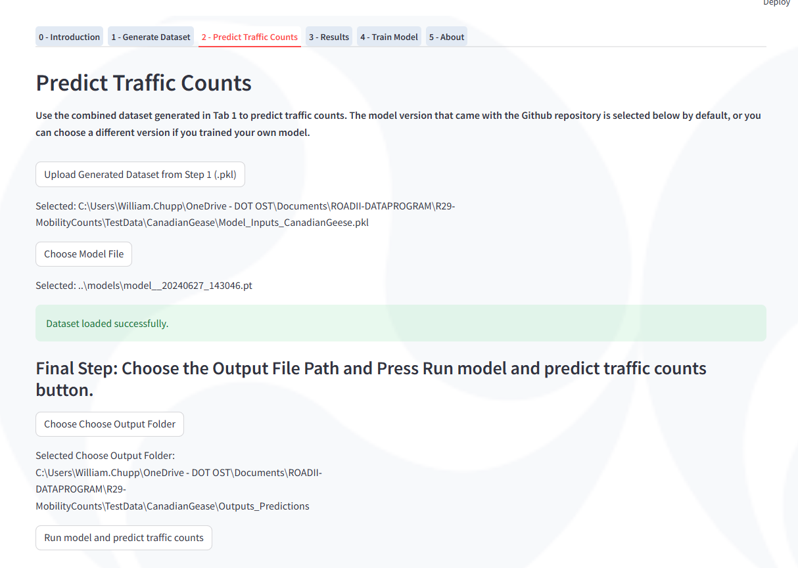
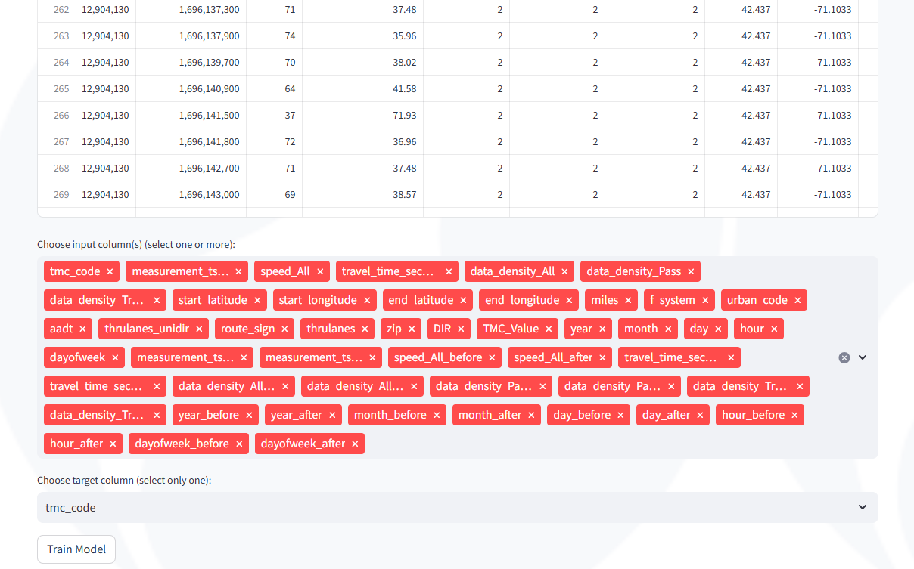

# README: U.S. DOT ROADII -- Mobility Traffic Counts AI Prediction
1. Project Description
2. Prerequisites
3. Usage
	* Building
	* Testing
	* Execution
4. Additional Notes
5. Version History and Retention
6. License
7. Contributing to the Code
8. Contact Information
9. Acknowledgements
10. README Version History

# 1. Project Description

### ROADII Background

Research, Operational, and Artificial Intelligence Data Integration Initiative (ROADII) is a multi-year initiative led by the United States Department of Transportation (U.S. DOT) Intelligent Transportation Systems Joint Program Office (ITS JPO).

ROADII’s vision is to expand U.S. transportation agencies’ (regional, state, local, tribal, etc.) access to advanced data analytics knowledge and resources including Artificial Intelligence (AI) and Machine Learning (ML). The ROADII team:
- Identifies and evaluates **use cases** that can benefit from advanced data analytics, AI, and ML
- Develops **proofs-of-concept** for use cases
- **Engages stakeholders** with proofs-of-concept and refine based on stakeholder feedback
- **Makes advanced data analytics, AI, and ML tools** available to the public at a central location (e.g., ITS CodeHub) 

The processes and tools developed under ROADII will enable data scientists, researchers, and data providers to test and share new transportation-related AI algorithms; to develop high-value and well-documented AI training datasets; to reduce the barriers of applying AI approaches to transportation data; and to train future transportation researchers.

For more information, visit ITS JPO [here](https://www.its.dot.gov/).

### ROADII Use Case 29 - Mobility Traffic Counts

- **Full Title:** “High-Resolution Mobility Traffic Count Estimation for Modeling, Planning, and Environmental Impact Applications” 
- **Purpose and goals of the project:** The Mobility Traffic Counts code base geographically matches **traffic counting station data** with **probe-collected speed data** on the U.S. National Highway System (NHS), to produce training datasets for roadway traffic volume prediction across the entire road system. The code provides a Graphical User Interface (GUI) to easily load input data, select input and target columns, and train a model using basic AI neural network methods.

Figure 1 shows traffic speed data on NHS roadway links. The speed data originate from U.S. DOT National Performance Management Research Dataset (NPMRDS) managed by the Regional Integrated Transportation Information System (RITIS).

*Figure 1. NHS Roadway Links with Speed Data*

Figure 2 shows the locations of over 8,000 U.S. Federal Highway Administration (FHWA), Travel Monitoring Analysis System (TMAS) stations for traffic counting and classification.

*Figure 2. TMAS Traffic Counting Stations*

Figure 3 shows the locations of NHS roadway links having TMAS traffic counting stations.

*Figure 3. NHS Roadway Links with TMAS Traffic Counting Stations*

Figure 4 shows U.S. Census 2020 Population Density by County as an example of the Census data used in the code base. The code base uses NHS roadway links where traffic counts and speed data are available, along with Census data; to perform prediction for NHS roadway links having similar Census data characteristics where traffic counts and/or speed data are not available.

*Figure 4. U.S. Census 2020 Population Density by County (Retrieved from https://maps.geo.census.gov/ddmv/map.html)*

- **Purpose of the source code and how it relates to the overall goals of the project:** This code base will make it easier and more approachable for transportation agencies to develop a simple neural network model to output historical traffic count data on NHS roadway links for which real world measured counts are not available. This is the case for most NHS roadway links. The intended user base includes state and local agencies looking to produce and use more complete traffic speed and traffic volume datasets. Applications of these resulting datasets and the code in this repository include highway planning projects and highway management projects, as well as future forecasting efforts.
- **Length of the project:** The code base is currently in development. The ROADII team will update this repository as stable builds of the code are created. Development and testing will likely continue through spring 2024. 

# 2. Prerequisites

Requires:
- Installation of Python 3.6.0 or later
- Installation of Python packages listed in *requirements.txt*
- Command prompt application to run the source code from the current working directory

# 3. Usage

### Building the Mobility Traffic Counts Model

The [ml](https://github.com/ITSJPO-TRIMS/R29-MobilityTrafficCounts/tree/main/ml) folder contains the modules and classes to read in the requisite training data for building the mobility counts model. The following modules are contained therein:

- **<main.py>:** Produces a Streamlit GUI that reads the training data files, normalizes all columns to numerical types, and runs a training loop on the normalized data to produce a neural network to predict the user-chosen target column
	* The user’s default web browser (e.g., Google Chrome, Microsoft Edge) opens a Streamlit application with the address "localhost:8501"
	* Once the web browser opens, the user may click “Open in App” to open a standalone Streamlit application
- **<use_model.py>:** Uses a cached model file (.pt format) to produce traffic count estimates. Also provides an easier, script based methodology to train a new model version without using the Streamlit application or interface. This is useful for more rapid model iteration
- **<setup_funcs.py>:** Sets up the various data sources for training the model
- **<module_data.py>:** Reads, formats, and joins the various data sources into a single training dataset. This includes the Traffic Monitoring and Analysis System traffic volume data and the National Performance Measurement Research Data Set speed data
- **<module_census.py>:** Connects the training data to census information to improve model performance
- **<module_ai.py>:** Defines the AI/ML training loop, the model architecture, and saves the resulting model for later use. Also provides methods to use a saved or cached model file 

### Testing The Model

The ROADII team is currently building testing functions for this code and will update the repository when those testing functions are available. 

### Executing the Model

The steps to run the model training algorithm are as follows:

1) Download the TMAS data for the analysis year of interest from the following website: [DANA Tool Input Data Installers](https://www.fhwa.dot.gov/environment/air_quality/methodologies/dana/)
2) Download the NPMRDS data for the analysis region of interest from the following website: [RITIS NPMRDS Analytics Site](https://npmrds.ritis.org/analytics/)
3) Download the included "TMC_Matches_2021.csv" file
4) In a command prompt application (e.g., Anaconda Prompt), execute the line **--> pip install -r requirements.txt** to ensure all necessary Python packages are up to date
5) Create a new folder at the same level as the “ml” folder named “data” and place “NPMRDS_TMC_TMAS_NE_C.csv” in “data”
6) Create a new folder at the same level as the “ml” folder” named “models”; the models trained by the source code are saved in this folder
7) Update the data file paths and directory file paths in main.py according to your working directory
8) Run *main.py* to produce the Streamlit GUI. For instance, execute the line in a command prompt application **--> streamlit run main.py**
9) After the GUI has loaded successfully, click the “choose source data file” button to select input data
10) After the GUI populates the “Raw Data” and “Normalized Training Data” viewing panes, use the “choose input columns" drop-down menu to select input data
11) After selecting the desired input columns for training, use the “choose a target column” drop-down menu to select the data field to predict, the results of which will be saved in a trained AI model
12) After a model has been trained successfully and saved in “models”; click “use model”

### Streamlit GUI Visuals

The following figures show in-development screenshots from the Streamlit GUI. The Streamlit GUI provides a main banner at the top, along with four (4) tabs that may be toggled by the user which are:

- "Train Model": User loads source data and trains an AI model on this tab
- "Test Model": User loads previously trained AI models and tests that AI model. User may perform tasks on this tab as long as they have previously trained AI models. If the user has not trained any AI models or no models are saved in “..\models”; then they should train models in the “Train Model” tab
- "Results": User views a U.S. map data visualization that shows the NHS road segments covered by input data, the NHS road segments covered by AI prediction, and mobility attributes (e.g., traffic counts, speed) on NHS road segments
- "About": User views links for helpful information related to this source code e.g., Points of Contacts, GitHub link, and README download link

Figure 5 shows the Streamlit GUI’s main banner at the top, and the user’s ability to choose a source data file as the input dataset. The main banner shows the current datetime and current build; the ROADII team may add other data in future versions. If the user clicks on the “Choose source data file” button, then a dialog box opens, and the user may explore files and select a source data file.

*Figure 5. Streamlit GUI – User Chooses Source Data File*

After the user chooses a source data file, the source code ingests the source data and displays an abridged sample of the source data in the “Train Model” tab. Figure 6 shows the user’s ability to view an abridged sample of the source data. In addition, the code base normalizes non-numerical data columns and the Streamlit GUI displays this “normalized” data in a separate pane in the same format as Figure 6, this “normalized” data pane is not shown in the figure.

*Figure 6. Streamlit GUI – User Views Input Data*

Figure 7 shows the user’s ability to choose input data columns and the target data column in AI model training – in the “Train Model” tab. The input data columns should not include the target column. After the user chooses input data columns and the target data column and clicks “Train Model” – then AI model training is initiated and the user will start to see in-progress results in their command prompt application. After AI model training is complete, the code base saves an AI model file to the sub-directory “..\models.”

*Figure 7. Streamlit GUI – User Selects Input Data for AI Model Training on a Targeted Metric*

In addition, the user may test a previously generated AI models without training an AI model – in the “Test Model” tab. In Figure 8, the user may click on the “Choose a model file” drop-down menu and select a model file (in .pt format) from “..\models.” Once a model file is selected, the user may click the “Test Model” button to begin testing.

*Figure 8. Streamlit GUI – User Tests Previously Generated AI Models*

In the “Train Model” tab, if the user chooses to train a new AI model, Figure 9 shows the AI model training progress with losses updating with each epoch on the Streamlit GUI. The x-axis is the number of AI training epochs; the user may set the number of training epochs in the source code, and the AI model training process ends once the number of epochs is reached. The y-axis is the logarithmic loss of the AI model training.

*Figure 9. Streamlit GUI – AI Model Training Losses vs. Epoch*

In addition to Figure 9 being shown on the Streamlit GUI, Figure 10 shows the AI model training process with a periodically updating graph in the command prompt application. In Figure 10, the x-axis is the percent difference (absolute value) between AI Model Training (i.e., Predicted Value) and Input Data (i.e., Expected Value), and the y-axis is the number of occurrences in a percent difference histogram bin. The bin size in Figure 9 is two (2) percent.

*Figure 10. AI Model Training – Histogram of Percent Difference (Absolute Value) between AI Model Training (i.e., Predicted Value) and Input Data (i.e., Expected Value)*

Figure 11 compares the predicted data versus input data and visually depicts the statistical correlation or R^2 value. The closer the scatterplot looks to a line with slope of 1, the closer the R^2 value is to 1. The x-axis is the expected value while the y-axis is the predicted value.

*Figure 11. AI Model Training – AI Model Training (i.e., Predicted Value) versus Input Data (i.e., Expected Value)*

Figure 12 shows real-time updating relative importance of the input training features (i.e., columns of the input dataframe).

*Figure 12. AI Model Training – Relative Importance of Input Training Features*

After the AI model training completes, the following outputs are seen on the command prompt application. The logarithmic loss, tensor, test loss, and R-squared values provide a high-level summary of the AI model training. The AI model is saved to “..\models.”

-------------------

Epoch [2500/2500],

Logarithmic Loss: 104156.6484375,

tensor([[2079.9739],
            [ 271.9318],
            [4203.4741],
            ...,
            [ 647.0178],
            [3022.9729],
            [ 242.9163]])
	    
tensor([[2846.],
            [ 394.],
            [5372.],
            ...,
            [2676.],
            [2528.],
            [ 103.]])
	    
Test Loss: 382541.6875,

R2: 0.8152651190757751,

36.359431140945375% are within 15.0 Percent of Expected,

Model weights saved to ../models/model__20240329_194737

Model file saved to ../models/model__20240329_194737

-------------------

*{to add: explanation of loss, tensor, and R2 values if helpful}*
 
*{to add: explanation of AI training outputs}*

*{to add: outputs and screenshots of “Test Model tab”}*

The user may proceed to the "Results" tab after training or testing an AI model. The user may choose a date and time range to display the input data and the predicted data using that input dataset. Figure 13 shows the datepicker widget in the Streamlit GUI.

*Figure 13. Results Tab - Date Picker to Filter Results (courtesy https://github.com/imdreamer2018/streamlit-date-picker)*

After the user has chosen a date and time range, Figure 14 shows the display of input data on a Folium map in the Streamlit GUI (filtered by datetime). Each road segment is indicated by a Folium icon and line segment. The icon and line segment are colored with respect to traffic volume, a darker shade of blue (input data) indicates that the traffic volume at that road segment is in a higher quintile within the entire set of traffic volumes. Figure 15, Figure 16, and Figure 17 are example close-up views of an urban, suburban, and rural road segment, respectively; arbitrary icon and road segment colors are used for these figures only for this readme document.

*Figure 14. Results Tab - Display of Input Data*

*Figure 15. Results Tab - Display of Input Data (Urban Road Segment)*

*Figure 16. Results Tab - Display of Input Data (Suburban Road Segment)*

*Figure 17. Results Tab - Display of Input Data (Rural Road Segment)*

*{to add: display of predicted data}*
*Figure 18. Results Tab - Display of Predicted Data*

# 4. Additional Notes

The geographic region that the algorithms use to train the model is determined by the NPMRDS data input into the code. Additional updates and improvements are planned in future releases and iterations.

**Known Issues:** None identified, this use case is still in development and future updates will be tested sufficiently before being released. 

**Associated datasets:** This use case incorporates NPMRDS, TMAS, U.S. Census, and other data sources to train the model discussed herein.

# 5. Version History and Retention

**Status:** This project is in active development phase. 

**Release Frequency:** This project will be updated when there are stable developments. This will be approximately every month. 

**Retention:** This project will likely remain publicly accessible indefinitely. 

# 6. License

This project is licensed under the Creative Commons 1.0 Universal (CC0 1.0) License - see the [License.md](https://github.com/usdot-jpo-codehub/codehub-readme-template/blob/master/LICENSE) file for more details. 

# 7. Contributing to the Code

Please read [Contributing.md](https://github.com/ITSJPO-TRIMS/R29-MobilityTrafficCounts/blob/main/Contributing.MD) for details on our Code of Conduct, the process for submitting pull requests to us, and how contributions will be released.

# 8. Contact Information

Contact Name: Billy Chupp

Contact Information: William.Chupp@dot.gov

Contact Name: Eric Englin

Contact Information: Eric.Englin@dot.gov

### Citing this code

Users may cite our code base and/or associated publications. Below is a sample citation for the code base:

> ROADII Team. (2024). _ROADII README Template_ (0.1) [Source code]. Provided by ITS JPO through GitHub.com. Accessed yyyy-mm-dd from https://doi.org/xxx.xxx/xxxx.

When you copy or adapt from this code, please include the original URL you copied the source code from and date of retrieval as a comment in your code. Additional information on how to cite can be found in the [ITS CodeHub FAQ](https://its.dot.gov/code/#/faqs).

# 9. Acknowledgements

- Billy Chupp (Volpe), William.Chupp@dot.gov
- Eric Englin (Volpe), Eric.Englin@dot.gov
- RJ Rittmuller (Volpe), Robert.Rittmuller@dot.gov
- Michael Barzach (Volpe), Michael.Barzach@dot.gov
- Jason Lu (Volpe), Jason.Lu@dot.gov

This project is funded by the U.S. DOT, ITS JPO under IAA HWE3A122. Any opinions, findings, conclusions, or recommendations expressed in this material are those of the authors and do not necessarily reflect the views of the ITS JPO.

### Languages

-Python [100.0%](https://github.com/ITSJPO-TRIMS/R29-MobilityTrafficCounts/search?l=python)

### About

This repository provides code for using ML methods to join national traffic datasets. One of these traffic data sets measure speed, and the other measures traffic volumes.

# 10. README Version History

*Table 1. README Version History*

